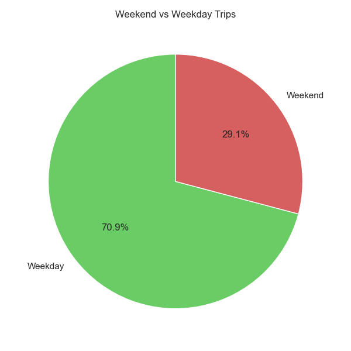

# NYC Yellow Taxi Trip Data

## Overview

This project analyzes NYC Yellow Taxi data to uncover patterns in fare pricing and trip behavior. Using a combination of spatial, temporal, and statistical analysis techniques, it investigates how factors like time of day, trip distance, and neighborhood location influence taxi fares. The final product includes visualizations, regression models, and interactive maps.

### Agenda:

1. Introduction
2. Background
3. Tools Used
4. Analysis
5. What I have learned
6. Insights
7. Conclusion

## 1. Inroduction

Urban mobility generates massive amounts of data that can be leveraged to improve transportation planning, pricing strategies, and user experiences. In this project, I explore how NYC taxi fares are determined and what role spatial and temporal variables play. By enriching trip data with neighborhood boundaries and analyzing both time-based and location-based trends, I aim to build an interpretable regression model to predict taxi fare amounts and identify key business insights.

## 2. Background

The dataset used combines multiple CSV files from the NYC Open Data Yellow Taxi trip records (January 2015 and January–March 2016). Each row contains data on pickup/dropoff times and locations, trip duration, distance, number of passengers, fare amount, and extra charges.
The spatial component was added by matching pickup coordinates with Neighborhood Tabulation Areas (NTAs) via a shapefile provided by NYC Open Data. This allowed me to cluster trips geographically and explore whether fares differ systematically by district.

## 3. Tools I Used

- Python for data processing and modeling

- pandas, numpy for data manipulation

- seaborn, matplotlib for visualization

- geopandas, shapely, folium for spatial analysis and mapping

- scikit-learn and statsmodels for regression modeling

- Jupyter Notebook for documentation and testing

- GitHub for version control and public code sharing

- VS Code as IDE

- PostgreSQL + PostGIS: For storing and querying geospatial data

- Used SQLAlchemy and GeoAlchemy2 to export GeoDataFrames directly to a PostGIS database

- Stored a sample of pickup points (pickup_points table) with SRID 4326 for future spatial queries and GIS integration

## 4. Analysis

## Connection to Database

```# Connect to local PostGIS database
from sqlalchemy import create_engine
from geoalchemy2 import Geometry

engine = create_engine("postgresql://username@localhost:5433/nyc_taxi_data")

# Save first 100 pickup points to PostGIS
gdf_pickup.iloc[:100].to_postgis(
    "pickup_points",
    engine,
    if_exists="replace",
    dtype={"pickup_geometry": Geometry("POINT", srid=4326)}
)

```

## Temporal Analysis

### At what times of the day does taxi demand peak or drop off?

This analysis explores the hourly distribution of taxi pickups to identify periods of high and low customer activity.

### Visualize

```# Count trips per pickup hour
df_hourly = df['pickup_hour'].value_counts().sort_index().reset_index()
df_hourly.columns = ['pickup_hour', 'count']

# Plot
sns.set_theme(style='darkgrid', palette='muted')
sns.lineplot(data=df_hourly, x='pickup_hour', y='count').set(
    title='Trips by Hour', xlabel='Hour of Day', ylabel='Trip Count')
plt.tight_layout()
plt.savefig('trips_by_hour.png')
plt.show()
```

### Results


### Insights

Lowest activity occurs around 4 AM, likely due to limited nightlife and minimal commuter traffic.

Demand starts to rise sharply after 6 AM, aligning with morning commute hours.

There’s a steady demand throughout the daytime, indicating consistent usage.

The peak is around 8–9 PM, suggesting a high volume of evening activities, such as restaurant, event, or entertainment outings.

→ Business takeaway:
Fleet allocation and driver shifts should be optimized to ensure higher availability during the evening peak and morning rush hour. Early-morning hours may require fewer active vehicles, reducing operational costs.

## How is taxi demand distributed between weekdays and weekends?

### Visualize

```
weekend_counts = df['is_weekend'].value_counts().sort_index()
labels = ['Weekday', 'Weekend']
colors = sns.color_palette("muted")[2:4]

plt.figure(figsize=(6, 6))
plt.pie(weekend_counts, labels=labels, colors=colors, autopct='%1.1f%%', startangle=90)
plt.title('Weekend vs Weekday Trips')
plt.tight_layout(); plt.savefig('weekend_vs_weekday_pie.png'); plt.show()
```

### Results



### Insights

Weekday trips dominate with approximately 71% of all rides, indicating consistent demand tied to work routines, commuting, and business operations.

Weekend trips make up only 29%, suggesting lower activity, likely due to reduced commuting but possibly increased leisure-related usage.

→ Business takeaway:
Fleet scheduling can be optimized by:

Maximizing driver availability on weekdays, especially during peak commuting hours.

Adopting a leaner weekend operation, reducing idle fleet time while still serving leisure travelers efficiently.

## Does seasonality impact taxi trip volume — or are observed seasonal differences a result of sampling bias?

### Vizualize

```
plt.figure(figsize=(8, 5))
sns.countplot(data=df, x='season', palette='muted')
plt.title('Number of Trips by Season')
plt.xlabel('Season'); plt.ylabel('Trip Count')
plt.tight_layout(); plt.savefig('trips_by_season_count.png'); plt.show()
```

### Results


### Insights

The chart shows a significantly higher number of trips in winter compared to spring.

However, this is not a true reflection of seasonal demand: the dataset includes January 2015 and January–March 2016, so winter months are overrepresented.

This leads to a sampling bias (Stichprobenverzerrung) — a misleading impression that winter is the most active season for taxi rides.

→ Data takeaway:
Before drawing conclusions, ensure your dataset is temporally balanced. In real-world projects, uneven date ranges can distort seasonality analyses, leading to inaccurate business decisions.

## How does daily taxi activity vary across January to March 2016, and can we detect any outliers linked to real-world events?

### Vizualize

```
df_2016['day'] = df_2016['tpep_pickup_datetime'].dt.day
pivot = df_2016.groupby(['pickup_month', 'day']).size().unstack(fill_value=0)

plt.figure(figsize=(12, 6))
sns.heatmap(pivot, cmap='YlGnBu')
plt.title('Heatmap of Trips by Month/Day (2016)')
plt.xlabel('Day'); plt.ylabel('Month')
plt.tight_layout(); plt.savefig('trips_by_month_day_2016_heatmap.png'); plt.show()

```

### Results


### Insights

Overall, taxi usage is fairly evenly distributed across most days in Jan–Mar 2016.

However, January 23 shows a sharp drop in activity across NYC.

This coincides with the Blizzard of January 2016, a major snowstorm that shut down transportation, closed roads, and led to a travel ban across the city.

Days like January 8 and March 4 saw peak activity, possibly linked to better weather or higher demand (e.g. Friday nights).

→ Business takeaway:
Weather events significantly disrupt mobility patterns. For ride-hailing or taxi services, real-time weather tracking and demand prediction must be integrated to optimize fleet deployment and minimize idle capacity or loss during extreme weather.

## Has overall taxi demand in January decreased year-over-year, and what factors may explain the change?

### Vizualize

```
jan_df = df[(df['pickup_month'] == 1) & (df['year'].isin([2015, 2016]))]
jan_counts = jan_df.groupby('year').size().reset_index(name='trip_count')

plt.figure(figsize=(6, 4))
sns.barplot(data=jan_counts, x='year', y='trip_count')
plt.title('Trips in January: 2015 vs 2016')
plt.xlabel('Year'); plt.ylabel('Trip Count')
plt.tight_layout(); plt.savefig('jan_2015_vs_2016.png'); plt.show()
```

### Results


### Insights

There is a noticeable decline in taxi trips from January 2015 to January 2016.

A likely contributor is the increasing popularity of ride-hailing platforms like **Uber** and Lyft, which were rapidly expanding during this time and competing with traditional taxis.

This shift signals a structural change in urban transportation behavior — not just a seasonal or weather-related anomaly.

→ Business takeaway:
Traditional taxi services may need to adapt pricing, improve digital accessibility, or explore partnerships and platform models to remain competitive in the evolving urban mobility ecosystem.

## How many trips occur on holidays, and can we even meaningfully compare behavior between holiday and non-holiday days?

### Vizualize

```
holiday_counts = df['is_holiday'].value_counts()

plt.figure(figsize=(5, 5))
plt.pie(
    holiday_counts,
    labels=['Non-Holiday', 'Holiday'],
    autopct='%1.1f%%',
    colors=['#88ccee', '#ddaa33'],
    startangle=90
)
plt.title('Share of Trips: Holidays vs Non-Holidays')
plt.tight_layout(); plt.savefig('num_trips_holiday_vs_nonholiday_pie.png'); plt.show()

```

### Results


### Insights

Only 3.8% of all trips in the dataset occurred on holidays.

This skew reflects that holidays are inherently rare events, typically fewer than 10–12 per year.

As a result, when analyzing taxi demand on holidays, we should be cautious:
→ There may not be enough data points to draw statistically strong conclusions.

However, this also signals an opportunity — understanding behavior on these rare days (e.g., New Year's Eve, Christmas, July 4th) may help uncover special patterns such as spikes in nightlife or airport traffic.

→ Business takeaway:
If properly captured, holiday demand forecasting could help optimize driver availability and dynamic pricing strategies during rare but high-demand events.

## Spatial Analysis

## 📍 Interactive Visualizations

## NYC Taxi Pickup Heatmap

This interactive heatmap visualizes 10,000 randomly sampled taxi pickups in New York City, highlighting areas with high ride density.

### Technology Used:

- Folium for map rendering

- Folium.plugins.HeatMap to overlay density

- Coordinates from the dataset: pickup_latitude, pickup_longitude

### How does it work:

```# Load and filter data
sample = df_all[['pickup_latitude', 'pickup_longitude']].dropna().iloc[:10000]

# Create base map centered on NYC
m = folium.Map(location=[40.75, -73.97], zoom_start=11)

# Add heatmap layer
HeatMap(data=sample.values, radius=8).add_to(m)

# Save to HTML
m.save("pickup_heatmap.html")
```

-> Interractive Map -> [Pickup Heatmap](https://chriskorol.github.io/NYC/pickup_heatmap.html)


## NYC Taxi Pickups by Neighborhood

This interactive map shows taxi pickup locations overlaid with NYC neighborhood boundaries (NTAs). It combines geographic shapefiles and point data to provide spatial context to taxi activity.

- [Average Fare by Neighborhood](https://chriskorol.github.io/NYC/map_avg_fare_by_neighborhood.html)

### What it does:

- Loads NYC’s official Neighborhood Tabulation Areas (NTA) shapefile using GeoPandas

- Converts pickup coordinates to geospatial points

- Uses a spatial join to match each pickup to the corresponding neighborhood

### Visualizes:

Neighborhood polygons (orange with borders)

A sample of 1,000 pickup points (blue circles)

Tooltips showing the neighborhood name on hover

```
# Convert pickups to geospatial points
gdf_pickup = gpd.GeoDataFrame(df_all, geometry=gpd.points_from_xy(...), crs="EPSG:4326")

# Spatial join with neighborhood shapefile
gdf_joined = gpd.sjoin(gdf_pickup, gdf_neighborhoods[['ntaname', 'geometry']], how="left", predicate='within')

# Build interactive map
folium.Map(...) + GeoJson layer + clustered pickup markers
```


## Regression Modeling

This section builds regression models to predict taxi fares based on trip characteristics and neighborhood context.

Great! Here's a clear, well-structured explanation of your **regression modeling workflow** and its output for your `README.md` file:

---

### 📊 Regression Modeling: Predicting NYC Taxi Fares

This section builds regression models to **predict taxi fares** based on trip characteristics and neighborhood context.

🗃 **Data Source:**
[`sampled_taxi_data_with_neighborhood.csv`](sampled_taxi_data_with_neighborhood.csv)
Includes cleaned pickup data, engineered time/duration features, and NYC neighborhood names via spatial join.

---

### 🧪 Modeling Approach

#### 🛠️ 1. Feature Engineering

- Numerical features: trip distance, passenger count, tip amount, tolls, extras, time/duration breakdown
- Categorical feature: `pickup_neighborhood` (encoded via One-Hot Encoding)

#### 🧼 2. Preprocessing

- **Standardization** for numeric features
- **One-Hot Encoding** for the categorical neighborhood column using `ColumnTransformer`

#### 🤖 3. Ridge & Lasso Regression

Two models were trained to handle multicollinearity and feature selection:

| Model       | Technique         | Purpose                                                           |
| ----------- | ----------------- | ----------------------------------------------------------------- |
| **RidgeCV** | L2 regularization | Shrinks coefficients, handles collinearity                        |
| **LassoCV** | L1 regularization | Performs feature selection by shrinking some coefficients to zero |

✅ **Cross-validation** (`cv=5`) and **automatic alpha tuning** with logarithmic search space

```python
ridge_pipeline = Pipeline([
    ('preprocess', preprocessor),
    ('ridge', RidgeCV(alphas=np.logspace(-3, 3, 20), cv=5))
])
```

#### 📈 4. Model Evaluation

Performance was evaluated using:

- **R² Score** – Explains variance
- **RMSE** – Root Mean Squared Error

```python
print("Ridge R2:", r2_score(y_test, y_pred_ridge))
print("Lasso RMSE:", np.sqrt(mean_squared_error(y_test, y_pred_lasso)))
```

---

### 🧾 OLS Summary Export

To interpret coefficient weights and statistical significance, a classic **OLS linear regression** was also run using `statsmodels`.

📄 The following file was exported:
[`regression_summary.csv`](regression_summary.csv)

It contains:

- Coefficients
- p-values
- Intercept term

---

### 🗺️ Visualization: Average Fare by Neighborhood

To visually assess pricing patterns, the average fare per pickup neighborhood was joined with NYC shapefiles and plotted on a choropleth map.

📍 **Output File:**
[`map_avg_fare_by_neighborhood.html`](https://chriskorol.github.io/NYC/map_avg_fare_by_neighborhood.html)


🎨 **Map Details:**

- Color gradient (YlOrRd) shows fare levels
- Hover tooltips show neighborhood names
- Helps detect **high-fare vs. low-fare zones**

* [PCA Behavior Clusters](https://chriskorol.github.io/NYC/pca_behavior_by_neighborhood.html)

## 5. What I Learned

- Data Cleaning: Handling nulls, filtering outliers, and aligning formats across multiple CSVs

- Spatial Join: Learned how to enrich point-based datasets with polygon-based metadata using GeoPandas

- Feature Engineering: Created meaningful variables like pickup_hour, trip_duration_min, and weekend flags

- Regression Techniques:

Ridge and Lasso for regularized prediction and feature selection

OLS for interpretability of coefficients and significance testing

- Mapping: Built interactive HTML maps to visualize spatial clusters and average fares using folium

- Version Control: Managed the project with commits and branches on GitHub

- Learned how to connect Python with a PostGIS database using SQLAlchemy and GeoAlchemy2

- Successfully stored geospatial data (pickup coordinates) in a relational format for further analysis or GIS visualization

## 6. Key Insights

_Trip Distance and Duration_ are the most influential predictors of fare, as expected.

_Neighborhood Effects matter:_ some areas consistently show higher base fares, even after controlling for other variables.

_Temporal Effects:_ Trip frequency and fare behavior show strong daily and weekly patterns (peaks in the morning/evening, less demand on weekends).

_Seasonal Disruptions:_ The snowstorm on January 23, 2016 led to a sharp drop in ride volume.

_Market Influence:_ A noticeable drop in taxi usage may also be attributed to rising competition from Uber and Lyft during the same period.

## 7. Conclusion

This project demonstrates the value of integrating spatial and temporal dimensions into traditional fare analysis. By combining regression techniques with location-aware features, we can generate more accurate and actionable models. The findings can help taxi companies adjust pricing, optimize fleet deployment, and better understand demand patterns across NYC.
